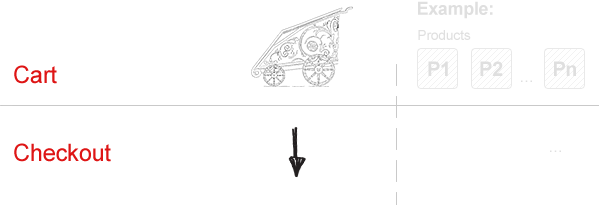
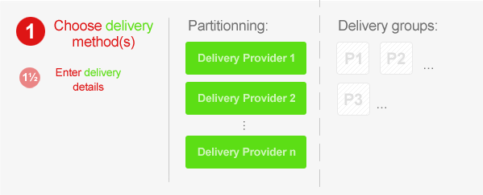
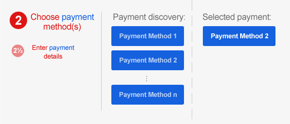
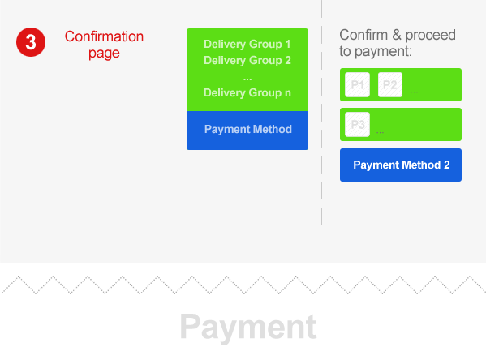

.. _checkout-order:

=====
Order
=====

Order is a snapshot of a cart with all customer, delivery and billing data
added. It does not change after it has been processed, no matter what changes
have been made to the products, prices or other data involved in the creation
of the order.

Therefore, ``Order`` and ``OrderItem`` objects hold a copy of the cart from
the time of pressing the *checkout* button.

Delivery groups and partitioners
--------------------------------

An order can be divided into several *delivery groups*. For example, if you
sell ebooks on numismatics, antique coins and refrigerators to keep them, you
may wish to enable download of the ebook immediately after the order has been
paid, send coins by messenger on the next day and ask wholesaler to send
refrigerator to the customer's address as soon as it arrives from the factory
(and hope the coins would survive until then ;)

The piece of code resposible for partitioning an order into delivery groups is,
surprisingly, called a *partitioner*. To read more, see the
:ref:`delivery section <checkout-delivery>`.

================
Checkout process
================

The default checkout process consists of 3 to 5 internal steps. At the
beginning of the checkout process, the cart becomes an order. For this to
happen, a list of partitioners takes turn to split the items from the cart
into delivery groups.

**1:** Each group designates a set of products that can be delivered together.
Now, for each delivery group, a list of :ref:`delivery providers
<checkout-delivery>` is queried for suitable delivery methods. Then the user
is asked to pick one of the methods for each group. Once the choice is
submitted, the **delivery providers** are queried whether further data is needed
for the methods picked. **1½:** If that is the case, the user is presented with
a form asking to provide additional info before being transferred to the
payment step.

**2:** Once we have the delivery details sorted out, a list of :ref:`payment
providers <checkout-payment>` is queried for payment methods suitable for the
order as a whole. The user gets to pick one, and again the **provider** is
asked whether further information is needed. **2½:** If so, the user will be
presented with a form asking for additional payment information.

**3:** At this point all we need is to confirm the order.

